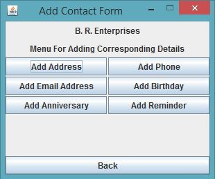

Contact Management System
====================================

_**1. Introduction to Contact Management System Java Application**_

The Contact Management System application based on Java is supposed to store basic details of employees associated with an organization. This application allows the user to add/remove/update and retrieve informations such as Address, Phone No., Email ID, Birthday and Anniversary of any person/employee. Application also allows the user to maintain a directory of reminders and can name it such as Team Meeting on some day with some person.

Contact Management System is completely on Java Applet and therefore is a small java application. In fututre, with considerable enhancements the application can have some form of connectivity through internet to increase accessibility across systems. The system would then also need to be more secure and flexible.

_**2. Limitations of this application**_

    •	 All the data entered using this application is available to the all users whose login credentials is present in "Login" file 
    •	 Lack of option to create, delete and modify an account. Credentials are, at present, entered manually in the "Login" file
    •	 Limitations in serach criteria for some specific searches. For example, reminders can be looked upon based on month
    •	 Entry ID associated with every record is not reusable. This means that if a record is deleted than the Entry ID which was associated with that record will not and can not be used for some other record
    
_**3. Execution Steps**_

i. Replace the java policy file "java.policy" present in the following relative directory of your system C:\Program Files\Java\jre-some-version\lib\security with the file provided here. This is being done to grant all permissions so that java applet works smoothly. More about Policy Files is present at - https://docs.oracle.com/javase/7/docs/technotes/guides/security/PolicyFiles.html
    
ii. No need to use any IDE to run the application. All one need to do is to run the batch file named "RunCMSApplication". This batch file will first compile all the java files and will create class files and then will also start the Java Applet Viewer.
	
iii. In order to login use the credentials which are present in "Login" file. For instance Login ID is 'cms' and Password is 'system'

_**4. Screen Captures**_

